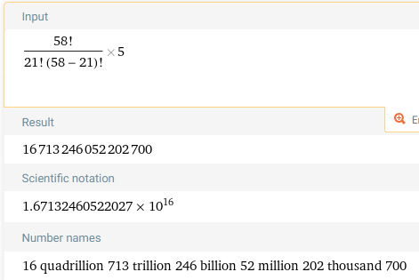

# Dominos's Pizza Combinations

A colleague at the Domino's store I work at recently tried to work out how many different pizzas we offer, he went for a simple factorial approach using the following calculation:
```
(58! / 21! (58-21)! ) * 5
```
---
His reasoning being that we offer 29 different toppings, each of which can be a double portion if requested (29 * 2 = 58)
<br>His result:<br>

[(Thanks Wolfram)](https://www.wolframalpha.com/input?i=%2858%21%2F%2821%21%2858-21%29%21%29%29*5)
---
Domino's wall art claims that there are "Gazillions of combinations", the 
[Merriam-Webster dictionary](https://www.merriam-webster.com/dictionary/gazillion)
defines that as "A huge unspecified number, so this calculation could be in the right ballpark.
---
There are however some constraints on ordering pizza through the app:
<br>Each pizza requires a sauce, a cheese or both
<br>There is a limit of 9 toppings, a double portion counts as 2 toppings, sauce and cheese also count as a topping, extra sauce/cheese counts as 2 toppings.
<br>*It may be helpful to think of having 9 "points" to spend on a pizza, it being mandatory to spend at least one of those points on sauce/cheese.*
<br> Personal / 7" Pizza: Classic Crust only
<br> Small / 9.5" Pizza: Classic Crust or Italian Style crusts
There are some restrictions on crust depending on pizza size:

|   Pizza Size    |  Classic Crust?  |  Italian Style?  |  Thin & Crispy?  |  Stuffed Crust?  |
|:---------------:|:----------------:|:----------------:|:----------------:|:----------------:|
|   Personal 7"   |        ✅         |        ❌         |        ❌         |        ❌         |
|   Small 9.5"    |        ✅         |        ✅         |        ❌         |        ❌         |
|  Medium 11.5"   |        ✅         |        ✅         |        ✅         |        ✅         |
|   Large 13.5"   |        ✅         |        ✅         |        ✅         |        ✅         |

In total, 11 types of pizza.
Now just the task of working out how many toppings combinations there are.
I hope that I may be able to do something like 58C9 to work out the combinations but the restrictions and double-portions may make this a more involved task.
As a simple estimate however let's try it:
```
A Maximum of 9 toppings
24 Toppings, each of which can be extra (48)
2 Sauces, each of which can be extra (4)
3 Cheeses, each of which can be extra (6)
58 total things.
At least one sauce or cheese must be chosen, leaving us with 8 points to spend elsewhere
Possible pizzas spending all points: 57 C 8 / 1652411475
1 billion 652 million 411 thousand 475
1.652411475 × 10^9
Multiply that by 11 as there are 11 types of pizza
1.8176526225 × 10^10
```
No longer gazillions but still enough to eat ~620,000 different pizzas each day of your life and still not try them all.
There are of course more as you do not HAVE to use the maximum amount of toppings available to you.
I think that is enough estimation, let's actually work this out.
---
The result of the code is: 
<br>163560573 Pizzas // 163 million 560 thousand 573
<br>1.63560573 × 10^8
<br>A lot smaller than the original estimate! About 10^8 times smaller in fact.
<br>Of course this number will vary depending on what promotions are available and what each individual store offers,
but I'm satisfied with this solution, to any Domino's workers reading feel free to fork and tweak the ingredients for your
specific store!
<br>
<br>
-Tom


